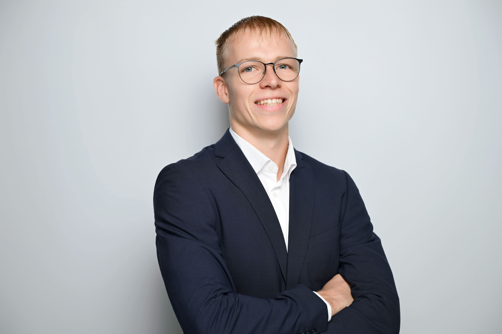

::: {.hero}
::: {.hero-flex}
::: {.hero-text}

Adam Hrehovcik

### Machine Learning, Data Science & Business Analytics

I've just completed an MSc Business Analytics & AI at Imperial College
London, currently joining Revolut as Operations Manager. This is a
collection of data science related projects and reports I've worked on,
with the full reports on what I did, the code behind my work, and what I
actually found.

[Machine Learning Projects →](machine-learning.qmd){.btn-hero}
[Business Analytics Projects →](business-analytics.qmd){.btn-hero}
[Download CV](files/Adam_Hrehovcik_CV.pdf){.btn-hero .btn-hero-outline}
[LinkedIn ↗](https://www.linkedin.com/in/adam-hrehovcik/){.btn-hero .btn-hero-outline target="_blank"}

:::

:::
:::

::: {.about-box}

## A bit about me

My background combines business and analytics in an interesting way. Since
my undergraduate degree was in Finance at the University of Warwick, I
started in traditional finance, with work experience in private equity,
M&A, and restructuring. However, I got increasingly pulled towards the
quantitative and technical side of decision-making. That's what brought me
to an MSc in Business Analytics, an internship at leading digital and
AI-focused consultancy OMMAX, and finally to scaling new products from the
ground up at Revolut New Bets.

[Read the full story →](about.qmd)

:::
