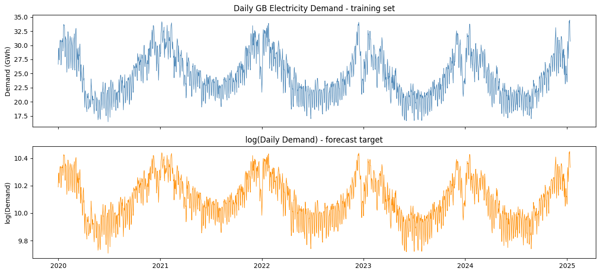
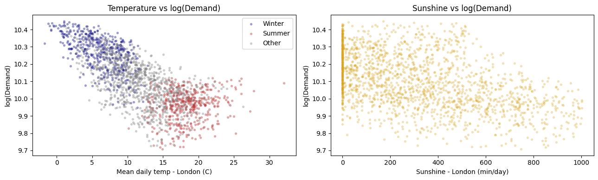
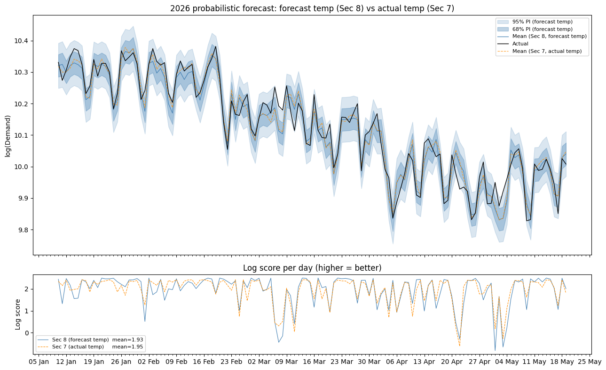

## The problem

Predict next-day electricity demand for England and Wales — not as a single
number, but as a full probability distribution (µ, σ) — across eight live
rounds of a forecasting competition. The scoring rule was log-likelihood, so
it punished both inaccurate point forecasts and poorly calibrated uncertainty:
a confident model that missed was penalised far more harshly than a wider,
more honest one.

## Approach

Three data sources: daily GB demand (National Grid), 6-hourly historical
weather for London/Bristol/Leeds (Meteoblue), and day-ahead weather forecasts
covering the same cities — the actual forecast inputs available at
prediction time, not observed weather.

**Validation design.** The main risk in a forecasting competition is silently
leaking future information into a model that looks great in backtests and
then underperforms live. Every forecast was generated on an **expanding
window**, refitting from scratch using only data more than two days old (the
real information barrier during the competition). Model selection used a
separate validation period (Jan–Mar 2025) from the final test period (Jan–May
2026), so tuning decisions couldn't bias the reported test score.

**Feature engineering (60 features).** Demand responds asymmetrically to
temperature — heating drives it up sharply below ~15.5°C, cooling drives it up
only mildly above ~22°C — so Heating/Cooling Degree Days replaced raw
temperature. Day length and sunshine (interacted with a low-heating-demand
regime) captured lighting and solar-substitution effects the temperature
features missed. Granular holiday dummies (Christmas, New Year, and Easter
decomposed into five separate day-types), demand lags at 2/7/364 days chosen
to respect both the information barrier and weekly/annual seasonality, and a
temperature-anomaly term for "surprise" weather rounded out the set.

**Model stack.** OLS on the full feature set as the baseline — it gives an
exact closed-form predictive distribution, which a tree model doesn't. XGBoost
was then fit on the OLS residuals (3-year sliding window) to pick up
nonlinear interactions OLS can't represent, and an AR(2,7) model mopped up the
remaining short-term serial correlation. All corrections are additive to the
mean only, so the OLS-derived predictive variance stays valid.

**Sigma calibration.** The multiplier on the predictive standard deviation was
tuned on the validation set — but optimising the *mean* log-score picked an
aggressive multiplier (0.783) that occasionally produced large negative
scores. With only eight competition rounds, that tail risk is not something
you can average away, so the multiplier actually used (1.167 for OLS alone,
0.924 for the full stack) instead maximised a risk-adjusted floor: mean minus
one standard deviation.

## Key findings

- **The full stack beat the OLS baseline on every metric**: out-of-sample
  mean log score of **1.931** vs. 1.682 for OLS alone (and 0.41 for a
  no-skill climatological baseline), RMSE of 3.57% vs. 4.47%.
- **Calibrating for risk mattered as much as model choice.** The
  mean-optimal sigma multiplier was smaller (more confident) than the one
  actually used — deliberately trading a little average score for protection
  against a single catastrophic round, which matters far more over 8 rounds
  than over a long backtest.
- **A real unit-conversion bug cost an entire round.** Forecast sunshine
  arrived in hours; training data was in minutes. The silent 60x mismatch
  underestimated sunshine and inflated the demand prediction on a
  particularly sunny day, dropping that round's score to a capped 0 instead
  of an estimated ~2.1. It was caught, diagnosed, and fixed before the next
  round — the kind of live-data bug that a backtest alone won't surface.
- **Final competition score: 15.179** across the 8 rounds (negative scores
  capped at 0 by the competition rules).







## Code

Asymmetric temperature response via Heating/Cooling Degree Days, one of the
60 engineered features:

```python
for city in ["london", "leeds", "bristol"]:
    features[f"HDD_{city}"]         = np.maximum(0, 15.5 - df[f"temp_{city}_mean"])
    features[f"CDD_{city}"]         = np.maximum(0, df[f"temp_{city}_mean"] - 22.0)
    features[f"temp_{city}_spread"] = df[f"temp_{city}_max"] - df[f"temp_{city}_min"]

# Lagged HDD (thermal inertia) and a weekend interaction
for city in ["london", "leeds", "bristol"]:
    features[f"HDD_{city}_lag1"] = features[f"HDD_{city}"].shift(1)

is_weekend = (df.index.dayofweek >= 5).astype(int)
for city in ["london", "leeds", "bristol"]:
    features[f"HDD_{city}_x_weekend"] = features[f"HDD_{city}"] * is_weekend
```

The OLS + XGBoost residual + AR(2,7) stack, refit on each forecast date:

```python
# OLS baseline, fitted on all data up to the information barrier
XtX_inv = np.linalg.inv(X_all.T @ X_all)
beta    = XtX_inv @ (X_all.T @ y_all)
resid_all = y_all - X_all @ beta

# XGBoost on OLS residuals -- 3-year sliding window, year_trend excluded
# (tree models can't extrapolate a linear trend past the training range)
xgb_mask  = all_clean.index >= last_date - pd.Timedelta(days=1095)
xgb_final = XGBRegressor(n_estimators=200, max_depth=4, learning_rate=0.05,
                          subsample=0.8, colsample_bytree=0.8, random_state=42)
xgb_final.fit(all_clean[XGB_FEATURE_COLS].values[xgb_mask], resid_all[xgb_mask])

# AR(2,7) mops up the remaining short-term serial correlation -- last 90 days only
ar_mask  = all_clean.index >= last_date - pd.Timedelta(days=90)
ar_vals  = resid_all[ar_mask] - xgb_final.predict(all_clean[XGB_FEATURE_COLS].values[ar_mask])
ar_model = AutoReg(ar_vals, lags=[2, 7], old_names=False).fit()

mu    = mu_ols + xgb_final.predict(x_xgb)[0] + ar_model.forecast(h)[-1]
sigma = np.sqrt(mse * (1.0 + x @ XtX_inv @ x)) * m_calibrated
```

- [Full notebook (.ipynb)](../files/energy-forecasting/energy-forecasting-notebook.ipynb)
