## The problem

Given the U.S. market's historically superior risk-adjusted returns, do U.S.
investors actually still benefit from international diversification, or does
adding other markets just dilute an already-efficient portfolio? Using MSCI
indices for nine major equity markets as proxies, the goal was to test
whether a deliberately-constructed optimal portfolio could beat a U.S.-only
allocation on a risk-adjusted basis — and if so, identify exactly which
non-U.S. markets were actually worth holding.

## Approach

**Data.** Monthly MSCI price and dividend-yield data (1995-2024) for nine
markets, adjusted for FX effects against the U.S. dollar to produce
USD-denominated total returns — clean monthly series per market, with index
inception gaps and misaligned dates corrected.

**Baseline: uniform Monte Carlo.** An initial 100,000-portfolio simulation
using uniform random weight sampling — the standard Monte Carlo approach —
found that MSCI USA's own Sharpe ratio (0.717) slightly *beat* the best
uniformly-sampled diversified portfolio (0.715). That result motivated
everything that follows: it suggested the true optimum wasn't a broadly
diversified portfolio, but something more concentrated that uniform sampling
was structurally unlikely to find.

**Why Dirichlet sampling.** Uniform random sampling (weights drawn uniformly,
then normalized) clusters candidate portfolios near equal weights — in a
universe dominated by one strong performer (MSCI USA), that systematically
underrepresents the concentrated, high-Sharpe allocations that are actually
optimal. Dirichlet sampling with a low concentration parameter (α = 0.5)
explores the corners of the weight simplex directly, surfacing concentrated
candidates uniform sampling would rarely propose.

**Hurdle-rate filter.** Even with Dirichlet sampling, diversification
benefits stayed modest — some markets were diluting portfolio efficiency
rather than improving it. The fix: test each market against a hurdle rate
derived from MSCI USA's own risk-adjusted performance before it's allowed
into the optimization at all —

$$\text{Hurdle}_i = \text{Sharpe}_{\text{USA}} \times \text{Corr}(i, \text{USA}) \times \text{Volatility}_i$$

— the minimum expected return a market must clear to justify inclusion,
given its correlation to the U.S. and its own volatility. Markets whose
expected return falls below their hurdle are excluded before the final
Dirichlet optimization runs.

**Period-specific analysis.** The full pipeline (baseline → Dirichlet →
hurdle-filtered Dirichlet) was run on three windows — the full 1995-2024
sample, a historical 1995-1999 slice (a period of strong U.S.
outperformance), and a recent 2020-2024 slice — to test whether
diversification's value is time-dependent.

## Key findings

- **Selective diversification beat U.S.-only, but the size of the edge
  depended entirely on how efficient the U.S. already was in that window.**
  Full period: filtered Sharpe ratio 0.754 vs. 0.717 for MSCI USA alone — a
  **5.1% improvement**. In 2020-2024, the edge widened to **12.1%** (0.734
  vs. 0.655). In 1995-1999, it shrank to **~2%** — the U.S. so thoroughly
  outperformed every peer that even an optimized global portfolio had little
  room to add value.
- **The U.S. stayed the core holding in every period, but its exact
  weight moved with how good the alternatives were.** Full-period filtered
  allocations ran 62-68% USA; in 1995-1999 (weak alternatives) it climbed to
  76-84%; in 2020-2024 (stronger alternatives) it eased to 67-75%. The
  answer to the original question is specific: diversification here means
  *adding* a handful of high-Sharpe, imperfectly-correlated markets to a U.S.
  anchor, not replacing U.S. exposure with a broad basket.
- **Correlations with the U.S. rose across the board, but the performance
  gap narrowed enough to more than offset it.** Rising correlations should
  mechanically shrink diversification value — but many non-U.S. markets
  closed the risk-adjusted performance gap with the U.S. over the same
  period (post-crisis macro stabilization, deeper capital markets, growth in
  higher-value sectors outside the U.S.). Net effect: *more* markets cleared
  the hurdle filter in 2020-2024 than in the 1990s, despite higher
  correlations across the board.
- **The specific diversifier that mattered changed by period, each for a
  different structural reason** — Turkey in 2020-2024 (high risk premia from
  currency/inflation instability, but genuinely low correlation to the U.S.
  cycle), Switzerland across the full period (defensive sector exposure —
  pharma, staples, financials — as a counterweight to a growth-heavy U.S.
  market), and the UK in 1995-1999 (energy/financials-heavy at exactly the
  moment U.S. equities were being driven by the dot-com tech surge).
- **Dirichlet sampling never underperformed uniform sampling, and the
  margin wasn't trivial.** Across every period and risk-free assumption
  tested, the Dirichlet-derived optimal portfolio matched or beat its
  uniform-sampling counterpart on Sharpe ratio — evidence the concentrated
  allocations it finds are genuinely more efficient, not just different.
- **Raising the assumed risk-free rate concentrated portfolios further
  into the U.S.** At a 4% risk-free rate (vs. 0%), optimal allocations
  tilted more heavily toward the U.S. and other high-return markets — a
  higher hurdle for excess return makes lower-return diversifiers harder to
  justify, so the optimizer leans further into the market with the strongest
  and most liquid nominal returns.


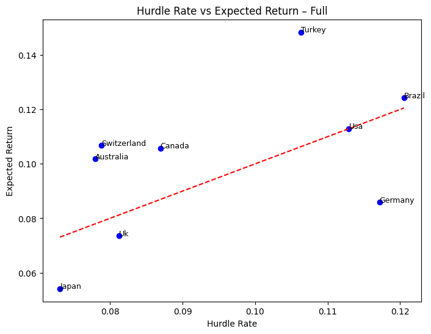

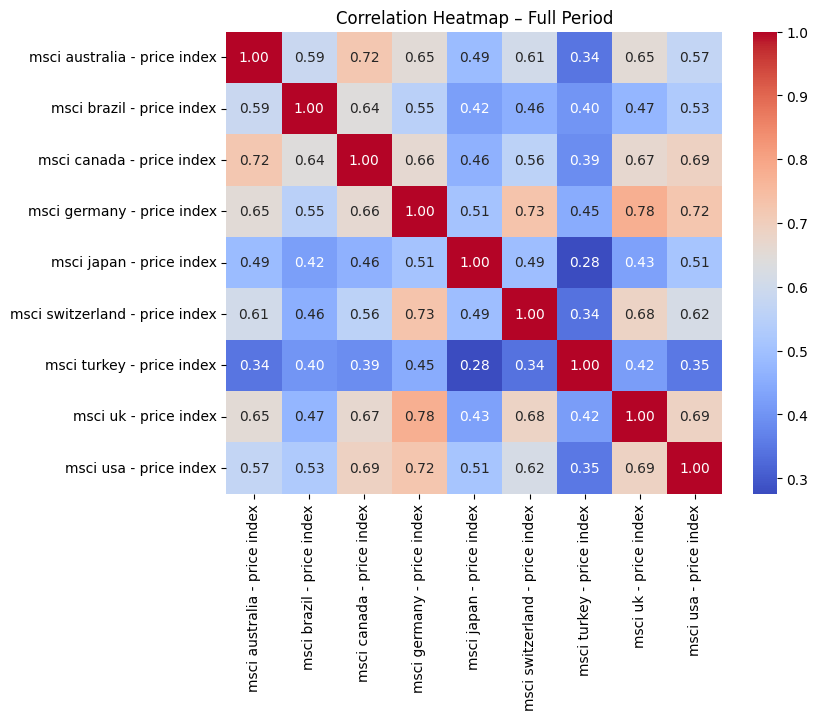

## Full report

*Notion doesn't allow its pages to be embedded (it blocks third-party
iframes outright) and the export tooling wasn't cooperating, so the complete
report is reproduced directly below rather than linked out — everything
past this point is the full original write-up, not a summary.*

### Portfolio optimization method comparison

Uniform vs. Dirichlet vs. hurdle-filtered Dirichlet, benchmarked against
MSCI USA, both risk-free assumptions. The filtered Dirichlet approach
comes out ahead of every alternative in every period tested.

**Full period**

| Portfolio | Sharpe (RF=0%) | Return (RF=0%) | Vol (RF=0%) | Sharpe (RF=4%) | Return (RF=4%) | Vol (RF=4%) |
|---|---|---|---|---|---|---|
| MSCI USA | 0.7174 | 0.1129 | 0.1574 | 0.4633 | 0.1129 | 0.1574 |
| Uniform MC | 0.7076 | 0.1064 | 0.1504 | 0.4416 | 0.1064 | 0.1504 |
| Dirichlet MC | 0.7465 | 0.1091 | 0.1461 | 0.4780 | 0.1140 | 0.1549 |
| **Filtered Dirichlet** | **0.7540** | **0.1118** | **0.1483** | **0.4847** | **0.1135** | **0.1516** |

**1995-1999**

| Portfolio | Sharpe (RF=0%) | Return (RF=0%) | Vol (RF=0%) | Sharpe (RF=4%) | Return (RF=4%) | Vol (RF=4%) |
|---|---|---|---|---|---|---|
| MSCI USA | 1.9464 | 0.2724 | 0.1399 | 1.6606 | 0.2724 | 0.1399 |
| Uniform MC | 1.6186 | 0.2367 | 0.1462 | 1.3451 | 0.2367 | 0.1462 |
| Dirichlet MC | 1.9540 | 0.2650 | 0.1356 | 1.6590 | 0.2650 | 0.1356 |
| **Filtered Dirichlet** | **1.9912** | **0.2605** | **0.1308** | **1.6907** | **0.2699** | **0.1360** |

**2020-2024**

| Portfolio | Sharpe (RF=0%) | Return (RF=0%) | Vol (RF=0%) | Sharpe (RF=4%) | Return (RF=4%) | Vol (RF=4%) |
|---|---|---|---|---|---|---|
| MSCI USA | 0.6546 | 0.1361 | 0.2080 | 0.4623 | 0.1361 | 0.2080 |
| Uniform MC | 0.6841 | 0.1160 | 0.1696 | 0.4537 | 0.1191 | 0.1743 |
| Dirichlet MC | 0.7245 | 0.1332 | 0.1839 | 0.5071 | 0.1336 | 0.1847 |
| **Filtered Dirichlet** | **0.7341** | **0.1349** | **0.1837** | **0.5205** | **0.1379** | **0.1881** |

### Correlations between markets

Correlations with the U.S. rose across almost every market over time —
normally a headwind for diversification value. What offset it: many
non-U.S. markets closed the risk-adjusted performance gap with the U.S. over
the same period, so more markets cleared the hurdle filter in 2020-2024 than
in the 1990s despite the higher correlations.

::: {.panel-tabset}
## Full period


## 1995-1999
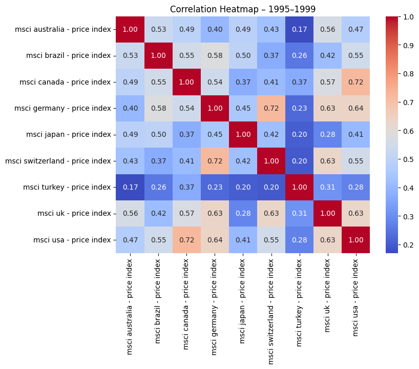

## 2020-2024
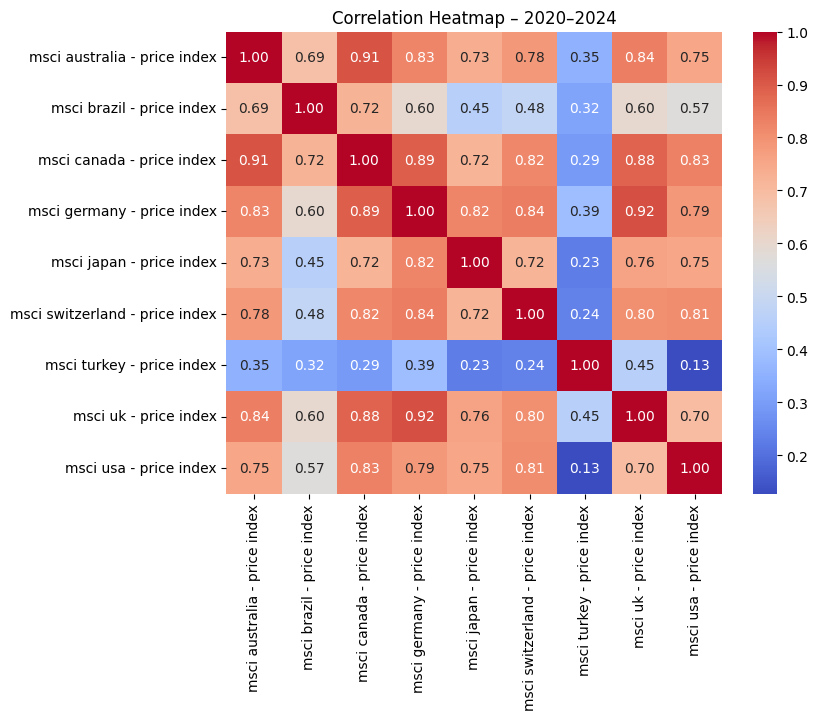
:::

### Hurdle-rate filtering

Each market's expected return plotted against its own hurdle rate — only
markets above the diagonal clear the bar and enter the filtered
optimization. The margin by which a market clears its hurdle tracks closely
with how much weight it ends up receiving: Turkey clears by a wide margin in
2020-2024 and picks up a ~23% allocation; markets that barely clear (or miss
entirely) get minimal or zero weight.

::: {.panel-tabset}
## Full period


## 1995-1999
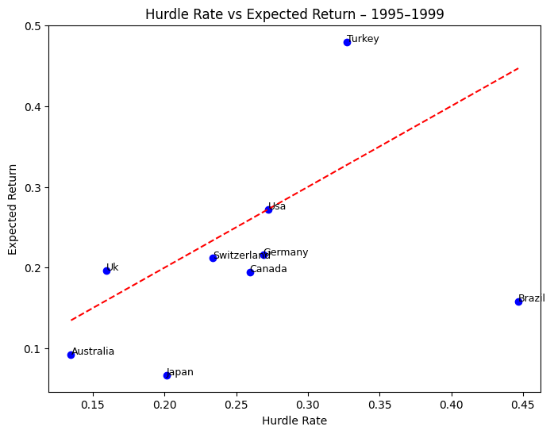

## 2020-2024
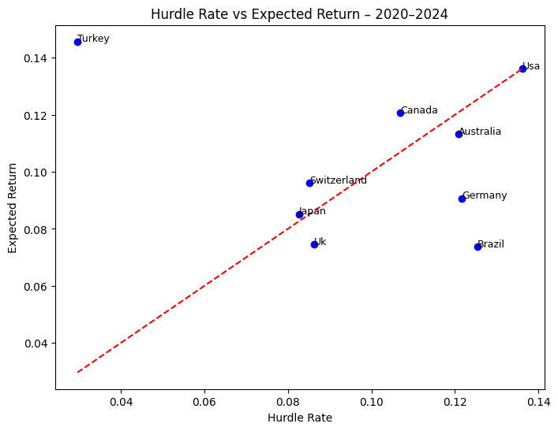
:::

### Optimized portfolio composition (filtered Dirichlet)

**Full period**

| Index | Weight (RF=0%) | Weight (RF=4%) |
|---|---|---|
| MSCI USA | 62.02% | 67.89% |
| MSCI Switzerland | 23.08% | 22.49% |
| MSCI Canada | 9.76% | 1.20% |
| MSCI Turkey | 3.32% | 6.23% |
| MSCI Australia | 1.81% | 2.12% |
| MSCI Brazil | ~0.00% | 0.06% |

**1995-1999**

| Index | Weight (RF=0%) | Weight (RF=4%) |
|---|---|---|
| MSCI USA | 76.05% | 83.79% |
| MSCI UK | 21.76% | 12.76% |
| MSCI Turkey | 2.19% | 3.44% |

**2020-2024**

| Index | Weight (RF=0%) | Weight (RF=4%) |
|---|---|---|
| MSCI USA | 66.66% | 75.24% |
| MSCI Turkey | 23.37% | 23.37% |
| MSCI Switzerland | 7.87% | 0.31% |
| MSCI Canada | 2.03% | 0.67% |
| MSCI Japan | 0.06% | 0.40% |

### Efficient frontier by period

The frontier's shape tells its own story about how much diversification
opportunity existed in each window. 1995-1999 is shallow and tightly
clustered — U.S. dominance was so complete that adding other markets mostly
just added volatility without proportional return. 2020-2024 is steeper and
more extended, reflecting a genuinely wider dispersion of risk-return
trade-offs and a real incentive to diversify.

::: {.panel-tabset}
## Full period
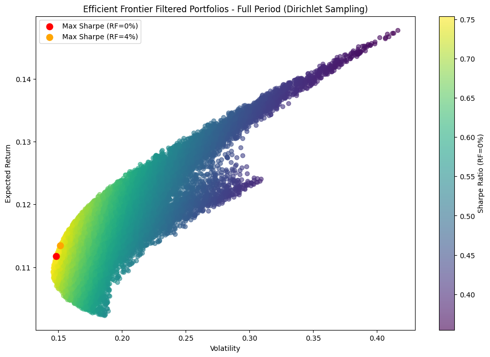

## 1995-1999
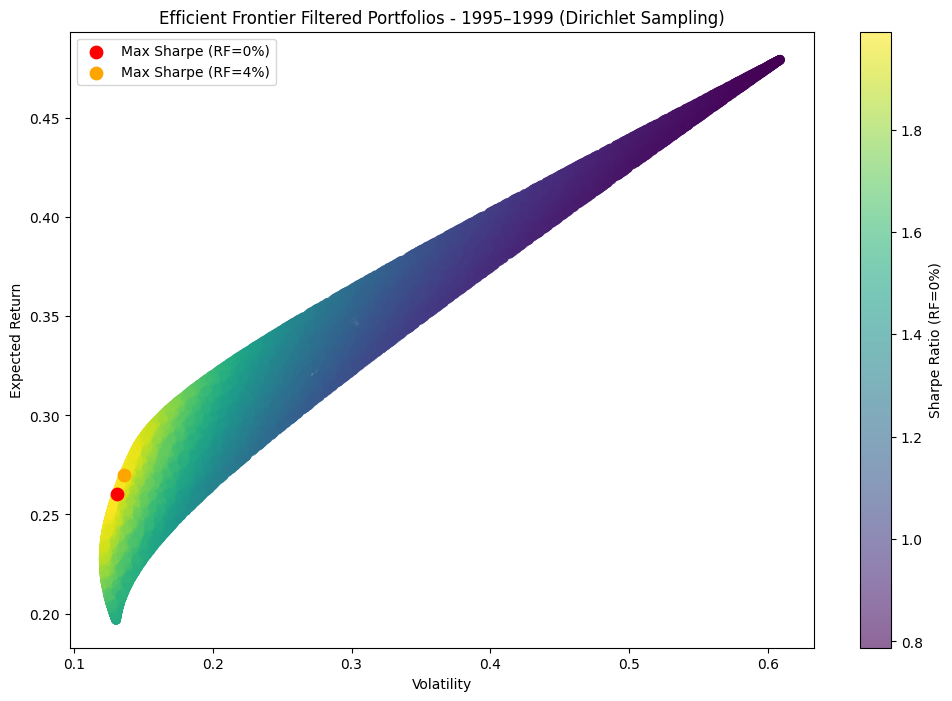

## 2020-2024
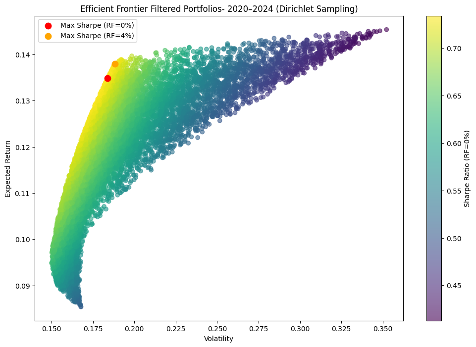
:::

### Sampling & filtering comparison

Overlaying all three approaches: Dirichlet sampling's frontier consistently
envelopes uniform sampling's, showing it explores the concentrated,
high-Sharpe edge cases uniform sampling underrepresents (uniform sampling
could theoretically reach similar allocations, but would need millions of
draws to do it, most producing near-zero weights on most assets rather than
the more meaningful allocations Dirichlet finds directly). Hurdle-filtering
then shifts the feasible set again, toward portfolios built only from
markets that earn their place.

::: {.panel-tabset}
## Full period
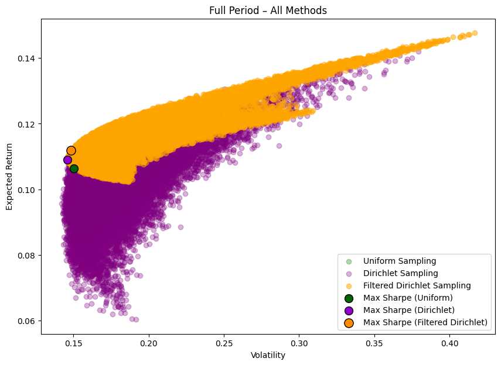

## 1995-1999
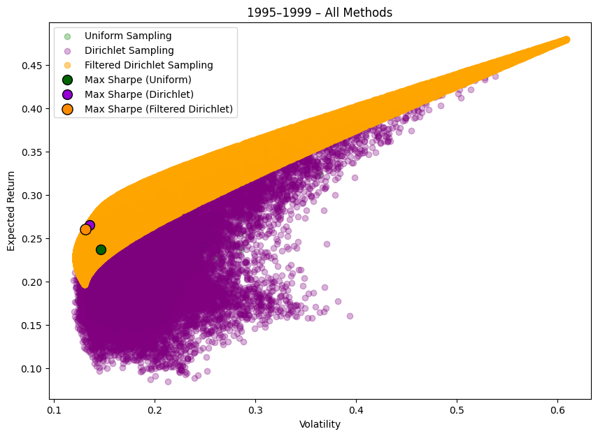

## 2020-2024
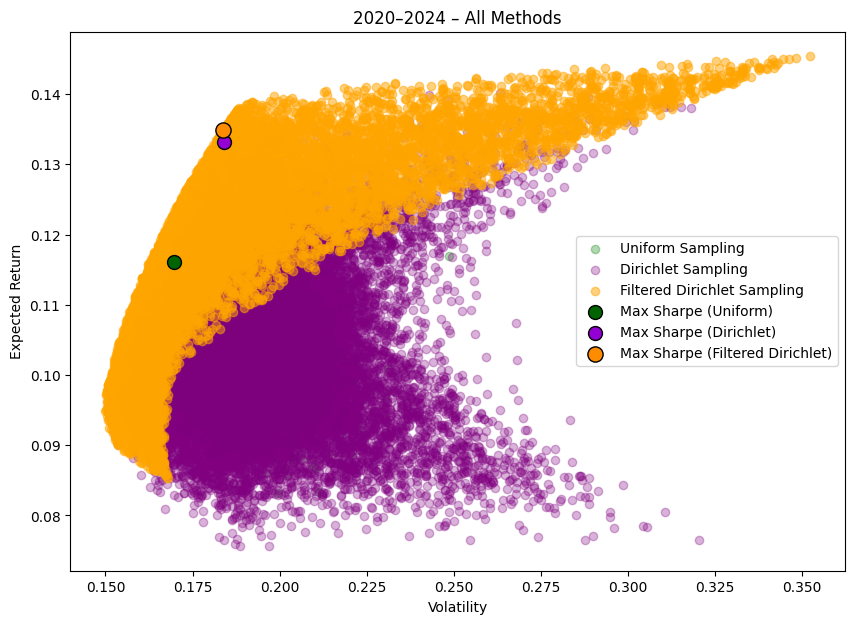
:::

### Index-level statistics

**Bold** = cleared the hurdle rate and was retained in that period's
filtered universe.

**Full period**

| Index | Exp. Return | Volatility | Corr. w/ USA | Hurdle Rate |
|---|---|---|---|---|
| **MSCI Australia** | **0.1019** | **0.1896** | **0.5727** | **0.0779** |
| **MSCI Brazil** | **0.1242** | **0.3180** | **0.5283** | **0.1205** |
| **MSCI Canada** | **0.1057** | **0.1754** | **0.6907** | **0.0869** |
| MSCI Germany | 0.0859 | 0.2258 | 0.7234 | 0.1172 |
| MSCI Japan | 0.0541 | 0.1990 | 0.5119 | 0.0731 |
| **MSCI Switzerland** | **0.1068** | **0.1782** | **0.6163** | **0.0788** |
| **MSCI Turkey** | **0.1484** | **0.4227** | **0.3505** | **0.1063** |
| MSCI UK | 0.0735 | 0.1646 | 0.6882 | 0.0813 |
| **MSCI USA** | **0.1129** | **0.1574** | **1.0000** | **0.1129** |

**1995-1999**

| Index | Exp. Return | Volatility | Corr. w/ USA | Hurdle Rate |
|---|---|---|---|---|
| MSCI Australia | 0.0927 | 0.1464 | 0.4729 | 0.1348 |
| MSCI Brazil | 0.1583 | 0.4209 | 0.5455 | 0.4468 |
| MSCI Canada | 0.1947 | 0.1853 | 0.7192 | 0.2594 |
| MSCI Germany | 0.2158 | 0.2175 | 0.6353 | 0.2689 |
| MSCI Japan | 0.0670 | 0.2552 | 0.4055 | 0.2014 |
| MSCI Switzerland | 0.2121 | 0.2184 | 0.5493 | 0.2335 |
| **MSCI Turkey** | **0.4796** | **0.6088** | **0.2759** | **0.3270** |
| **MSCI UK** | **0.1969** | **0.1303** | **0.6277** | **0.1592** |
| **MSCI USA** | **0.2724** | **0.1399** | **1.0000** | **0.2724** |

**2020-2024**

| Index | Exp. Return | Volatility | Corr. w/ USA | Hurdle Rate |
|---|---|---|---|---|
| MSCI Australia | 0.1132 | 0.2445 | 0.7546 | 0.1208 |
| MSCI Brazil | 0.0737 | 0.3375 | 0.5675 | 0.1254 |
| **MSCI Canada** | **0.1206** | **0.1964** | **0.8315** | **0.1069** |
| MSCI Germany | 0.0907 | 0.2366 | 0.7852 | 0.1216 |
| **MSCI Japan** | **0.0852** | **0.1680** | **0.7516** | **0.0826** |
| **MSCI Switzerland** | **0.0961** | **0.1613** | **0.8071** | **0.0852** |
| **MSCI Turkey** | **0.1457** | **0.3541** | **0.1279** | **0.0297** |
| MSCI UK | 0.0746 | 0.1885 | 0.6996 | 0.0863 |
| **MSCI USA** | **0.1361** | **0.2080** | **1.0000** | **0.1361** |

### Practical takeaway

U.S. investors can meaningfully improve portfolio efficiency by selectively
diversifying into a small set of high-Sharpe, low-correlation international
markets — Turkey, Switzerland, and Canada were the standouts here, not a
broad international basket. Guided by a hurdle-rate framework, these
targeted allocations delivered 5-12% Sharpe improvements over a U.S.-only
portfolio, and that edge has grown in recent years as global peers close
the performance gap with the U.S.

## Code

The core Monte Carlo loop — uniform vs. Dirichlet sampling of portfolio
weights, evaluated across thousands of draws:

```python
def run_portfolio_simulation(returns_df, risk_free_rate=0.04, num_ports=20000,
                              seed=42, sampling="uniform", alpha=1):
    np.random.seed(seed)
    num_assets = returns_df.shape[1]
    all_weights = np.zeros((num_ports, num_assets))
    ret_arr = np.zeros(num_ports)
    vol_arr = np.zeros(num_ports)
    sharpe_arr_0 = np.zeros(num_ports)

    for x in range(num_ports):
        if sampling == "dirichlet":
            # Concentration parameter alpha < 1 pushes draws toward the
            # corners of the simplex -- exactly the concentrated allocations
            # uniform sampling under-explores.
            weights = np.random.dirichlet(np.ones(num_assets) * alpha)
        else:
            weights = np.random.random(num_assets)
            weights /= np.sum(weights)

        all_weights[x, :] = weights
        ret_arr[x] = np.sum(returns_df.mean() * weights) * 12
        vol_arr[x] = np.sqrt(np.dot(weights.T, np.dot(returns_df.cov() * 12, weights)))
        sharpe_arr_0[x] = ret_arr[x] / vol_arr[x]

    max_sr_idx = np.argmax(sharpe_arr_0)
    return {
        'weights_0': all_weights[max_sr_idx],
        'sharpe_0': sharpe_arr_0[max_sr_idx],
        'ret_0': ret_arr[max_sr_idx],
        'vol_0': vol_arr[max_sr_idx],
    }
```

The hurdle-rate filter — excluding markets that don't clear a
correlation-and-volatility-adjusted bar before re-optimizing:

```python
def compute_index_stats(df, index_name='msci usa - price index'):
    annualized_return = df.mean() * 12
    annualized_volatility = df.std() * np.sqrt(12)
    correlation_with_usa = df.corr()[index_name]
    index_sharpe_ratio = annualized_return / annualized_volatility
    # Hurdle_i = Sharpe_USA * Corr(i, USA) * Volatility_i
    hurdle_rate = correlation_with_usa * index_sharpe_ratio[index_name] * annualized_volatility
    return pd.DataFrame({
        'Expected Return': annualized_return,
        'Correlation with MSCI USA': correlation_with_usa,
        'Hurdle rate': hurdle_rate,
    })

def filter_by_hurdle(df, stats_df, period_label):
    expected_col = f"Expected Return ({period_label})"
    hurdle_col = f"Hurdle rate ({period_label})"
    selected_assets = stats_df[stats_df[expected_col] >= stats_df[hurdle_col]].index
    return df[selected_assets], stats_df.loc[selected_assets]
```

- [Full notebook (.ipynb)](../files/international-diversification/international-diversification-notebook.ipynb)

<!-- Raw MSCI/FX data files intentionally not published -- commercially
licensed index data, not ours to redistribute. The notebook documents the
exact source files it expects (MSCI returns.csv, MSCI dividends.csv, FX
returns.csv) for anyone reproducing this with their own data access. -->
