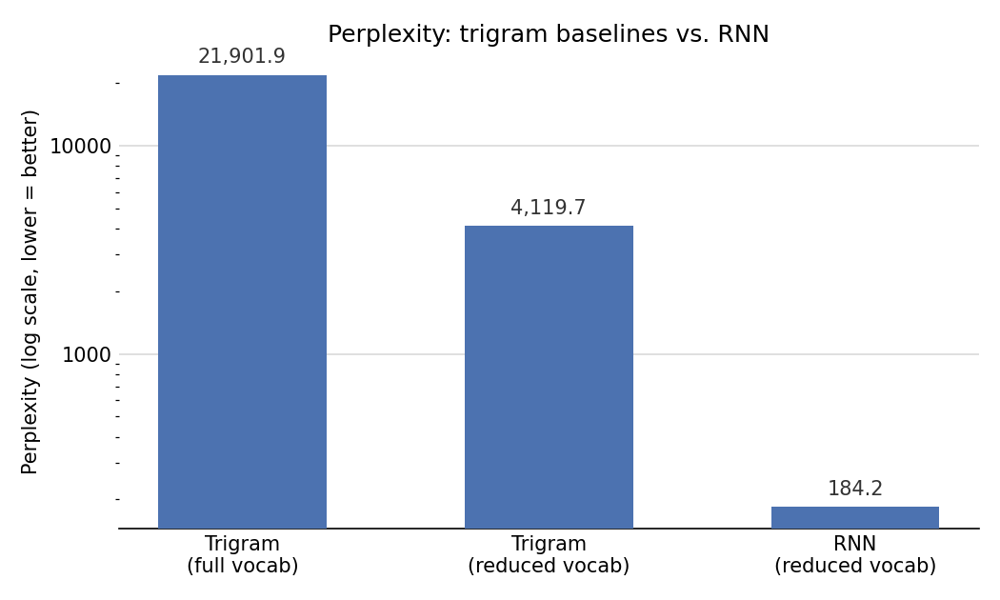

## The problem

Can a language model trained from scratch (no pretrained embeddings, no
prebuilt tokenizer) generate movie reviews that pass as human-written — and
how do you actually measure "passes as human," beyond just eyeballing the
output? The assignment required building a statistical baseline, a neural
language model, and a discriminative classifier to test the neural model's
output against real reviews, then reflecting honestly on what each stage
could and couldn't do.

## Approach

**Tokenization.** Word-level tokenization over subword methods (like BPE) —
less compact, but every token is human-readable, which made it far easier to
debug the pipeline and inspect vocabulary decisions at every stage.
`<START>`/`<END>` mark sentence boundaries, `<PAD>` supports fixed-length
batching, `<UNK>` absorbs rare words after vocabulary reduction.

**Trigram baseline (N=3).** A bigram conditions on too little context to
capture phrase structure; a four-gram, given the corpus size, would mostly
fall back on smoothing rather than observed counts. Trigram was the pragmatic
middle ground, with Laplace (k=1) smoothing so perplexity stays finite even
over unseen contexts.

**Vocabulary reduction for the LSTM.** Softmax cost scales with vocabulary
size, so training on the full ~104K-word vocabulary wasn't feasible in the
time available. Keeping only the top 20% most frequent tokens (20,823 words)
cut the softmax output layer drastically while still covering 97.3% of token
occurrences — the `<UNK>` rate in training data came out to just 2.7%.

**Architecture.** `Embedding(128) → LSTM(128) → Dense(softmax)`, trained on a
fixed 20-token context window (chosen against the corpus's median sentence
length of 17). Alternatives tried and rejected: a smaller 72-unit LSTM
(meaningfully hurt validation accuracy — hidden size is the real bottleneck
on context capacity), an extra dense layer before the softmax (disproportionate
cost, since it sits right before the vocabulary-sized layer), and larger
embeddings (diminishing returns against the ~1hr training budget).

**A real bug worth including.** A stride-based downsampling rule kept only
every *k*-th training position — except a "keep_end" special case that always
retained `<END>` targets regardless of stride, meant to stop short sentences
being underrepresented. That asymmetry silently inflated `<END>`'s frequency
in the training targets relative to every other token. The trained model
learned this distortion perfectly: it assigned `<END>` ~90% probability at
the very first decoding step, collapsing generation immediately. Diagnosed by
checking the empirical `<END>` frequency in training targets against the true
corpus distribution — a data construction bug, not a modelling one. Fixed by
applying stride uniformly and instead explicitly keeping each sentence's
first two positions (protecting short-sentence coverage without biasing the
target distribution).

**Discriminator.** A second, deliberately shallow model —
`Embedding → Gaussian noise → global average pooling → Dense(ReLU) → sigmoid`
— trained to distinguish real reviews from the LSTM's own generations, both
represented in the *same reduced vocabulary* (otherwise the discriminator
could cheat by keying off `<UNK>` density instead of learning real structural
differences).

## Key findings

- **The LSTM cut perplexity by >20x over the reduced-vocabulary trigram**
  (184.2 vs. 4,119.7) and by >100x over the full-vocabulary trigram
  (21,901.9) — a large, unambiguous jump in raw predictive performance.
- **But a simple, shallow discriminator still separated real from generated
  text almost perfectly** — ROC AUC 0.975, accuracy 92%. That gap is the
  actual headline finding: perplexity says the LSTM models local structure far
  better than a trigram, while the discriminator shows it still hasn't
  matched the true distribution of real reviews. Both can be true — better
  next-token prediction doesn't automatically mean indistinguishable text.
- **Generated text is fluent but generic.** The LSTM leans hard on
  high-frequency phrases ("very good", "a little too long") and coherence
  degrades over longer sequences — consistent with the discriminator's recall
  gap (53 real reviews misclassified as fake) showing partial, not full,
  distributional overlap.
- **The stride/`<END>` bug is the more useful lesson than any hyperparameter
  choice** — the collapse looked like a modelling failure but was entirely a
  data construction artifact, caught by checking target-token frequencies
  against the corpus rather than by tuning the network.



**Sample generations, trigram vs. LSTM:**

| Method | Generated text |
|---|---|
| Trigram (greedy) | *the film is a very good* |
| Trigram (top-10) | *and i was watching a very bad acting and a half of the film is that it was very good* |
| LSTM (greedy) | *the film is a very good film* |
| LSTM (top-10) | *its a great movie but its not a great movie for the time of this film* |
| LSTM (top-10) | *the film was a little too long* |

## Code

Trigram counting and generation — the statistical baseline:

```python
def build_trigram_counts(dataset):
    all_sentences = []
    for text, y in dataset:
        for sentence in tokenize_text(text):
            all_sentences.append(["<START>"] + sentence)

    trigram_counts = {}
    for sentence in all_sentences:
        for i in range(2, len(sentence)):
            w1, w2, w3 = sentence[i-2], sentence[i-1], sentence[i]
            context = (w1, w2)
            trigram_counts.setdefault(context, {})
            trigram_counts[context][w3] = trigram_counts[context].get(w3, 0) + 1
    return trigram_counts
```

The LSTM language model — embedding, single recurrent layer, softmax over the
reduced vocabulary:

```python
model = keras.Sequential([
    layers.Input(shape=(max_len,)),
    layers.Embedding(input_dim=reduced_vocab_size, output_dim=128, mask_zero=True),
    layers.LSTM(128),
    layers.Dense(reduced_vocab_size, activation="softmax"),
])
model.compile(optimizer="adam", loss="sparse_categorical_crossentropy",
              metrics=["sparse_categorical_accuracy"])
```

The discriminator — intentionally shallow, so a strong result says something
about the generator's remaining gap, not the classifier's sophistication:

```python
disc = keras.Sequential([
    layers.Input(shape=(max_len_disc,)),
    layers.Embedding(input_dim=reduced_vocab_size, output_dim=64, mask_zero=True),
    layers.GaussianNoise(0.05),
    layers.GlobalAveragePooling1D(),
    layers.Dense(256, activation="relu"),
    layers.Dropout(0.3),
    layers.Dense(1, activation="sigmoid"),
])
disc.compile(optimizer=keras.optimizers.Adam(1e-3),
             loss="binary_crossentropy",
             metrics=["accuracy", keras.metrics.AUC(name="AUC")])
```

- [Full notebook (.ipynb)](../files/movie-review-generator/movie-review-generator-notebook.ipynb)

<!-- Trained model weights (.keras, ~65MB) intentionally not published here —
too large for a public GitHub Pages repo, and not needed to show the work:
the notebook re-trains the same architecture from scratch. -->
