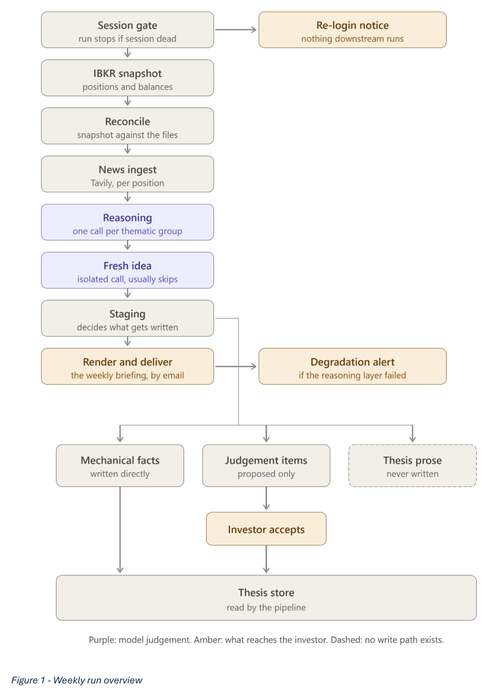

## The problem

Running a concentrated, thesis-driven equity portfolio (20+ positions across
several long-term themes) means the real bottleneck isn't finding
information — it's reaching the small fraction of a week's news that
actually bears on a specific thesis, out of a much larger volume of
short-term noise that doesn't. Doing that filtering by hand every week
doesn't scale. The goal was an agentic workflow that takes on that filtering
end-to-end and hands back a single weekly briefing worth reading, without
taking any actual decision-making away from the investor.

## Approach

**A thesis store as the grounding layer.** Every position was already
documented during initial research with a valuation floor, named catalysts,
kill switches, and staged entry triggers. That research became a structured
retrieval layer — one YAML file per position — so the workflow always
reasons against the specific investment logic for that name rather than in
the abstract.

**Reasoning is the only layer that interprets.** Price-level triggers are
simple enough to check deterministically in Python. Everything else — what
a week's news and price action actually mean for a position — is left to an
LLM (Claude, via Claude Code's headless CLI), with the interpretive output
kept in its own field, separate from the factual record, so the investor can
see not just the conclusion but the reasoning behind it.

**Writing privileges scale inversely with judgement.** The workflow helps
keep the thesis files current, but purely mechanical updates sync
automatically while anything carrying a judgement call is only proposed and
waits for the investor to accept it. Thesis prose itself is never rewritten
automatically, under any circumstance.

**A separate channel for the unexpected.** Documented catalysts and risks
are, by construction, the things already thought of when the thesis was
written. The briefing carries a second channel for anything material that
doesn't map to any of them, so the system doesn't just confirm the shape of
its own prior research.

**Failure is disclosed, never hidden.** A quiet week and a broken pipeline
stage can look identical from the outside — an empty section either way —
so a stage failure never just shrinks the briefing silently. It degrades
gracefully and fires a separate alert naming the likely cause instead.

## System architecture

The weekly run is a fixed, gated pipeline: a dead brokerage session halts
everything before it starts (rather than risk a briefing built on stale
data), and every step past that point degrades independently on failure
instead of aborting the whole run.

## Key findings

- **Most of the design effort went into restraint, not capability.** Keeping
  retrieval separate from judgement, confining automatic writes to
  mechanical facts, and distinguishing a quiet week from a failed run don't
  make the system more capable — several make it *less* convenient — but
  they're what make its output something to act on directly rather than
  verify first.
- **The access constraint shaped the whole system, not just one component.**
  Interactive Brokers' retail accounts can't reach the OAuth path, so the
  only route is a local gateway process authenticated by a browser login
  that lapses roughly daily. That single constraint is why the pipeline
  opens with a session gate, why the practical target was "~30 seconds of
  human action" rather than full automation, and why the whole thing runs
  on a local scheduled task rather than anything hosted.
- **The honest limitation: the reasoning layer is unvalidated.** Output was
  judged by reading it across real weeks, which is a reasonable bar for a
  personal tool, but there's no way to tell whether the model ever missed
  something a human reading the same articles would have caught — and a
  miss like that is invisible in a way a wrong call isn't.

## Full report

*The full write-up covers the design philosophy behind each constraint in
more detail, the build order (nothing was layered on top of a component
until the one beneath it was validated against real data), and the
integration decisions — including why news retrieval runs through a
dedicated search API rather than an LLM's own web search tool.*

<iframe src="../files/portfolio-monitoring-agent/portfolio-monitoring-agent-report.pdf" width="100%" height="800px" style="border:1px solid #ddd;"></iframe>

[Open full report in a new tab ↗](../files/portfolio-monitoring-agent/portfolio-monitoring-agent-report.pdf){target="_blank"}

<!-- Full source not linked here -- the codebase reads directly from a live
brokerage session and personal thesis files, and the report above already
covers the architecture and design reasoning in full. -->
