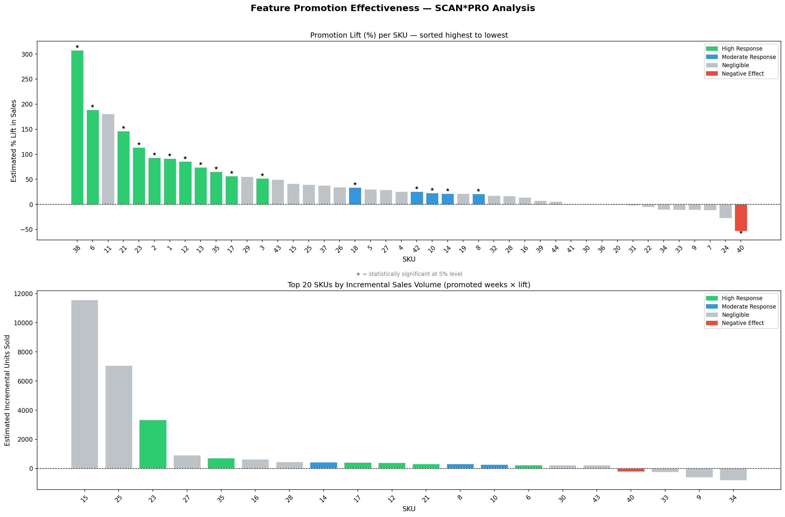
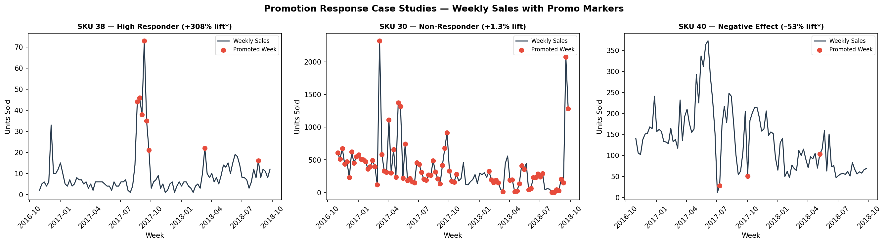
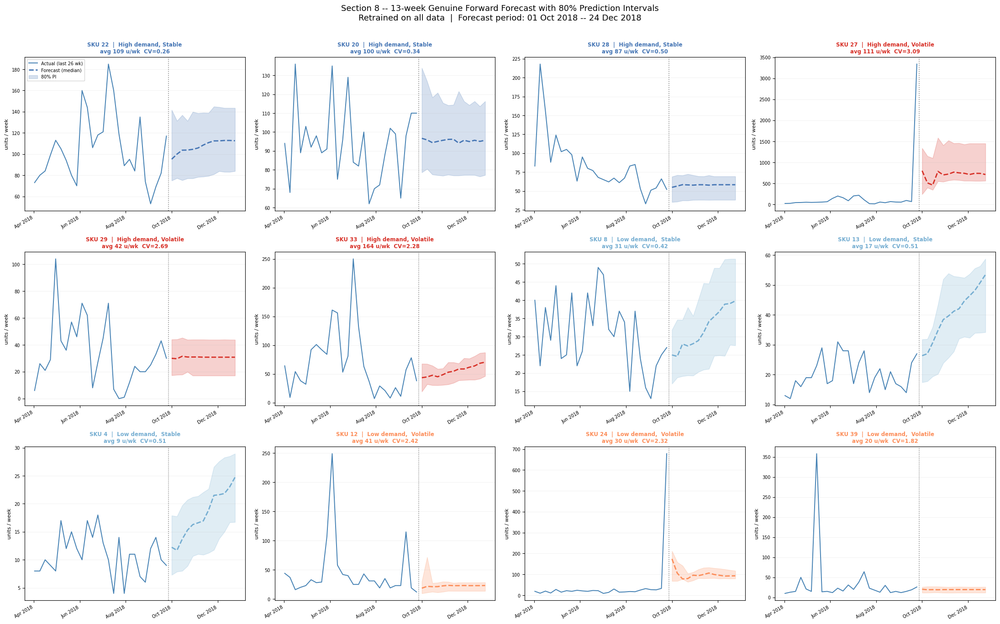

*Team project. I was technical coordinator — integrating teammates' demand
forecasting, pricing, and promotion-effectiveness analyses into one
dashboard — and also did a substantial share of the forecasting work itself
(model selection, quadrant segmentation, forward forecasting).*

## The problem

A team project analysing 98 weeks of sales for a 44-SKU e-commerce
electronics catalogue, split across three separate analytical strands
(demand forecasting, pricing/promotion effectiveness) that started life as
three separate notebooks. The question that mattered to the business: which
SKUs need a price change, a promotion, or neither — and what's the expected
impact? Answering that meant putting all three analyses in front of the same
person, looking at the same SKU, at the same time — not three PDFs a
stakeholder has to cross-reference themselves.

## What I built

My role was primarily **technical coordination**: taking teammates' separate
demand-forecasting, pricing, and promotion-effectiveness work and integrating
it into a single three-tab Streamlit dashboard, rather than three
disconnected deliverables. I also did a substantial share of the forecasting
work directly — model selection across four candidates, the demand-quadrant
segmentation, and the final 13-week forward forecast.

- **Tab 1 — Marketing Mix Overview**: a C-level summary — 2×2 demand matrix,
  channel attribution, key demand signals.
- **Tab 2 — Demand Forecasting**: SKU-level operational planning. LightGBM
  quantile regression producing a 13-week P50 forecast with 80% prediction
  intervals, per-SKU signal flags (declining / volatile / uncertain), and a
  catalogue-wide segmentation view.
- **Tab 3 — Pricing & Promotion**: SCAN*PRO log-linear regression results for
  all 44 SKUs — per-SKU recommendation cards, elasticity distribution, a
  portfolio price simulator, and a four-quadrant strategic action matrix.
- **AI layer**: Llama 3.3 70B (via Groq) grounded in the live dashboard
  data for natural-language Q&A on both the forecasting and pricing tabs —
  additive only, every chart and recommendation works fully without it.

## Key findings

- **Promotion strategy was undifferentiated, and the data shows it**: 35.8%
  of all SKU-weeks were featured on the homepage, but only 16 of 44 SKUs
  (36%) show a statistically significant positive lift. 27 SKUs show no
  measurable return at all — feature-slot budget was being spent without
  regard to whether it worked.
- **Scarcity beats frequency.** The highest-lift SKUs (38: +308%, 6: +189%,
  21: +146%) share a profile of low baseline sales and infrequent featuring —
  customers respond to featuring as a credible signal precisely because it's
  rare. Meanwhile SKUs 30 and 15, featured in 80 of 100 weeks, show
  essentially zero lift (SKU 30's effect has p=0.94) — a textbook case of
  promotion fatigue.
- **One SKU actively loses sales when promoted.** SKU 40 has a statistically
  significant *negative* effect (-53%, p=0.006) — flagged for investigation
  rather than continued featuring.
- **Price is the dominant demand driver, and two feature-importance methods
  disagreed about it.** Random Forest importance ranked discount_pct above
  the absolute price level; Lasso's standardised coefficients (which control
  for collinearity) showed price carrying the largest coefficient in the
  model by a wide margin. Where the two methods disagree, that's a modelling
  question worth resolving, not a footnote — RF's impurity-based importance
  systematically understates price here because it's collinear with the lag
  features.
- **LightGBM was chosen over a neural network despite a marginally worse
  MAE** (62.7 vs. 61.5), because it natively supports quantile regression —
  P10/P50/P90 intervals without retraining — which the MLP can't match
  without significant added complexity. Best relative accuracy (MAPE 50.8%)
  sealed it.
- **Forecast error concentrates in volatile SKUs, not evenly across the
  catalogue.** Roughly 46% of SKUs have a coefficient of variation above 1.0,
  and a handful of them (25, 27, 30) account for most of the aggregate
  forecast error — a data reality the model can't paper over, so those SKUs
  are flagged for wider intervals and manual review rather than automated
  action.







## Live dashboard

The dashboard runs fully without an API key — every chart, forecast, and
recommendation below works out of the box. AI Q&A panels are off by default;
paste your own free [Groq key](https://console.groq.com/keys) into the "🔑 AI
features" panel in the sidebar to turn them on for your session only.

<iframe src="https://marketing-retail-ai-dashboard.streamlit.app/?embed=true" width="100%" height="800px" style="border:1px solid #ddd;"></iframe>

[Open dashboard in a new tab ↗](https://marketing-retail-ai-dashboard.streamlit.app/){target="_blank"}

## Code

The SCAN*PRO per-SKU regression — one OLS model per SKU, isolating the
promotion effect from price and trend:

```python
for sku_id in sorted(df["sku"].unique()):
    sku_df = df[df["sku"] == sku_id].copy().dropna(subset=["log_sales"])
    sku_df = sku_df.sort_values("week").reset_index(drop=True)
    sku_df["trend"] = np.arange(len(sku_df))

    X = sm.add_constant(sku_df[["feat_int", "log_price", "trend"]])
    y = sku_df["log_sales"]
    model = sm.OLS(y, X).fit()

    coef, pval = model.params["feat_int"], model.pvalues["feat_int"]
    pct_lift   = (np.exp(coef) - 1) * 100
    baseline   = sku_df[sku_df["feat_int"] == 0]["weekly_sales"].mean()
    incremental = baseline * (np.exp(coef) - 1) * sku_df["feat_int"].sum()
```

LightGBM quantile regression for the 13-week forward forecast — three
models (P10/P50/P90) trained per run, refit on all available data:

```python
for q, label in [(0.10, 'lower'), (0.50, 'median'), (0.90, 'upper')]:
    m = lgb.LGBMRegressor(
        objective='quantile', alpha=q,
        n_estimators=n_trees, learning_rate=0.03, max_depth=6,
        num_leaves=40, min_child_samples=10,
        subsample=0.8, colsample_bytree=0.8,
        reg_alpha=0.1, reg_lambda=0.1, random_state=42,
    )
    m.fit(X_all, y_all)
    full_models[label] = m
```

- [Full repo on GitHub](https://github.com/AdamHrehovcik/RMA_Project)
